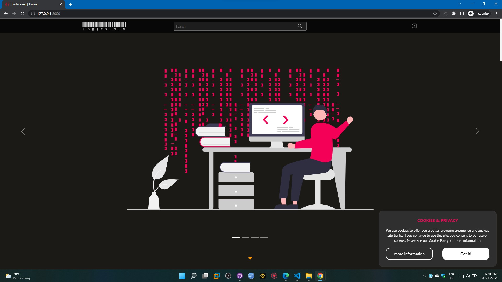
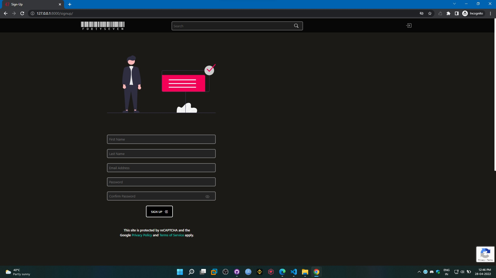
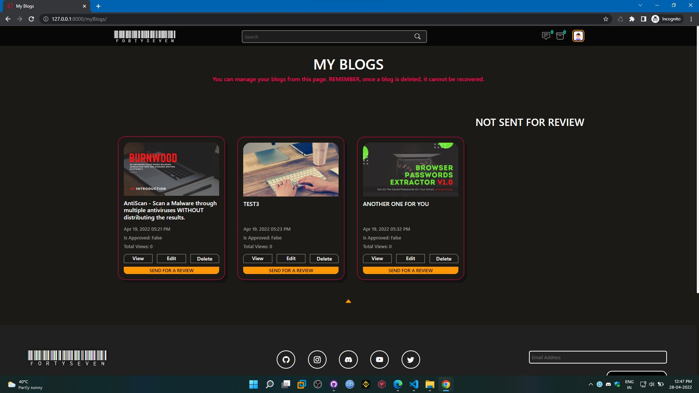
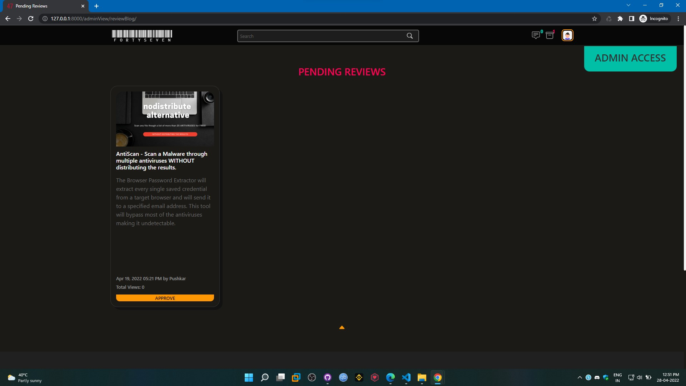
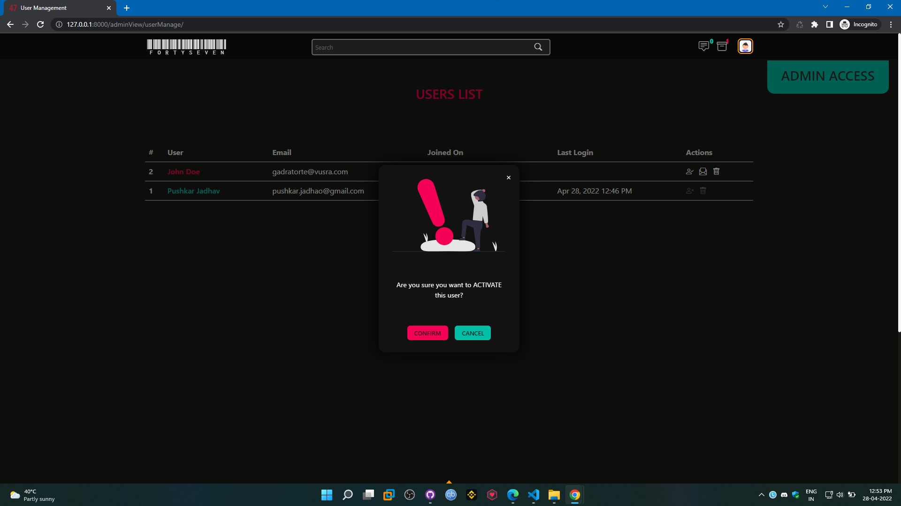

# Django-Bootstrap Blogging Template Pro

This is a **Free**, **Production grade**, django-bootstrap blogging template along with **Personal Portfolio**. It consist of various unique features mentioned below.

**NOTE**: I'll continuously be updating this template and add new features, make sure you fork it and in case you like it, please don't forget to leave a **STAR**!

The **LIVE VERSION** of this website can be seen here: 
>**Blog**: https://thefortyseven.dev  
**Portfolio**: https://thefortyseven.dev/portfolio

# Features:
Complete List of Features:
- Responsive and Minimal Design 
- Latest Bootstrap 5 and Django 4
- Secret /admin URL (define your own URL for admin login page)
- REST API based user Login and Signup
- Group based user access
- reCaptcha Integrated  Login/Signup Page
- Cookie Consent box
- Blog based Unique IP based view count 
- Email based user account verification
- Email based user password reset option
- Editable User Profile
- Froala Editor for writing blogs
- Search Blogs and Users
- Most Viewed Blogs and Recently Updated Blogs section
- Preview Blog before sending for approval
- User Types: 
	- **Superuser** 
		- Edit/Delete any blog from ANY user .
		- Approve a blog and make it live.
		- Manage user account (Block any user account, Change Password, Edit User Profile Data).
		- Resend Verification Email.
		- View Contact Messages.
		- Manage Subscriptions .
	- **Staff**
		- Create/Edit/Delete own blogs.
		- See a List of own blogs along with it's Publish Date and Total Views in 'My Blogs' section.
	- **Viewer** 
		- Comment on any blog
- AWS Deployment Ready
- About, Legal, Contact, Donate Pages
- Sensitive Credentials are stored as ENV variables

# Services - Technologies Used:
The technologies used are listed below:
- Frontend: Bootstrap
- Backend: Django
- Database: PostgreSQL

The technologies used are listed below:
- Server: Apache
- Hosted on: AWS EC2
- Email SMTP: AWS SES
- Static Content: AWS S3
- Database: AWS RDS Postgres and Local
- SSL: Free SSL from CertBot Integrated

# Defaults:
By default, 
- A user created through signup page is a **Viewer** user type.
- A blog needs to be sent for review so as to get an approval and make it live, until then it sits in the user profile only.
- Editing a blog will take it down from live and it needs an approval again.
- Search Bar will query through Blog Titles and Users FirstName, LastName. 

# Screenshots:

# Screenshots:
### HOMEPAGE

### LOGIN

### SIGNUP

### MY BLOGS

### APPROVAL PAGE

### ACTIVATE USER

